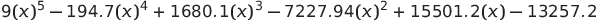

# Genetic Algorithm - Equation Root

## Description
**Genetic Algorithm** solution to find non-linear polynomial **equation root** 

in this specific problem the equation is:
\


## Getting Started
### Dependencies
Install dependencies by running following command:
\
```pip install -r requirements.txt```
### Executing

```python root_genetics.py```

### Result
Here is final result while running program.
\
`Root is 4.8848070675332`

### Authors
Amir Rezaei [@ameerezae](https://github.com/ameerezae)